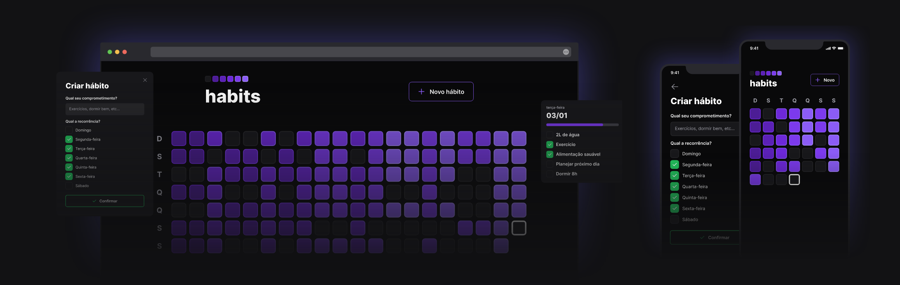

## Technologies

- [Zod](https://github.com/colinhacks/zod)
- [Expo](https://expo.dev/)
- [React](https://reactjs.org/)
- [Axios](https://axios-http.com/)
- [Prisma](https://www.prisma.io/)
- [Fastify](https://www.fastify.io/)
- [Tailwind](https://tailwindcss.com/)
- [TypeScript](https://www.typescriptlang.org/)
- [React Native](https://reactnative.dev/)

## Run Local

Run the following command in both server and client directories to start the application.

```bash
$ npm run dev
```

Run the following command in the mobile directory to start the mobile application.

```bash
$ npx expo start
```
